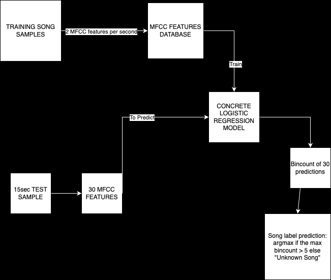

# Concrete_Shazam
A privacy preserved version of Shazam using Concrete-ML.

## Approaches

### Fingerprinting Method from the SHAZAM paper
The method described in [SHAZAM Paper](https://www.ee.columbia.edu/~dpwe/papers/Wang03-shazam.pdf) uses fingerprinting to retrieve songs. The algorithm in a nutshell is as follows:
- Generate the spectogram of the audio samples in the training database
- Detect peaks(local maximas) in the spectogram, optionally reduce the number of peaks considered by picking only top-T percentile peaks.
- For each peak choose a fixed size window and consider the top-k closest peaks in the window, Then produce k fingerprints where each fingerprint is the hash of (peak 1 freq, peak 2 freq, Time difference between the peaks)
- Store the fingerprints in a DB with their corresponding IDs
- Similarly generate fingerprints for the test sample and match the hash with the already present hashes in the database.

While this is very efficient(Time complexity with Binary search: O((sample fp_size)*log(Database fp_size))) in a usual setting, this is challenging to implement in the FHE mode.

It is closely related to the PSI problem(Private Set Intersection). As described in the paper [Fast Private Set intersection from Homomorphic Encryption](https://eprint.iacr.org/2017/299.pdf) it is possible to achieve similar time complexity however this has not been attempted for now as it involves low level cryptographic optimisations.

The file `fingerprinting_approach.py` uses this fingerprinting approach but instead of matching the fingerprints, each fingerprint is treated as a feature vector and a Decision Tree is trained on them. This Approach is not scalable at all and takes around 7 minutes for just 10 songs in the training set. Hence I use a different approach.

### Main Approach: MFCC features based Logistic Regression

The workflow is described in the above chart and has been demonstrated in the Main_analysis.ipynb Notebook. The whole notebook takes around 6 minutes to run(On MacBook Pro M2 with 8GB RAM) and gives the results for 400 songs selected from the `fma_small.zip` dataset. The model was also evaluated on a 1000 song subset and the results are presented in the Results Section.
The process is also described in the notebook in the form of markdown blobs.

Logistic Regression uses One Vs All approach to model multiclass outputs. While this is accurate the size of the model during the `model.compile(inputset)` stage increases significantly which utilises a lot of RAM. This presents an issue in Scaling. 

The good part of this approach is that the predictions are returned in FHE to the client. Hence the server not only does not get the plaintext features but it also does not get the plaintext prediction of the song which gives strong privacy.

## Using the Repository

To run the notebook just modify the constants in the constants section.
- MUSIC_DB_PATH: The path to fma_small dataset of any folder containing the .mp3 training files.
- TEST_SAMPLE_PATH: The path to directory which contains your testing samples.
- MFCC_SAMPLES_PER_SEC: By default two mfcc features are generated per second for a sample, You can generate more samples per second for better accuracy or reduce this to reduce the number of features in training database.
- NUM_SONGS: The number of songs in the training set that you want to consider for training. 

Alternatively there is also a `client.py` and a `train.py` file for production deployment. To use them follow the instructions here [Deployment Guide](https://github.com/zama-ai/concrete-ml/blob/release/1.3.x/use_case_examples/deployment/breast_cancer_builtin/README.md)

## Challenges in Scaling: Next Steps

When it comes to scaling the model we are presented with two challenges which give a tradeoff:
- Accuracy
- Time/ Memory Constraints

While each of these challenges can be handled seperately to achieve them together gives us a tradeoff. 

The Problem of Time/Memory Constraints can be handled by using a small ML model with 8k class prediction vector. 

To address the Accuracy concern regardless of the number of classes we could use a Contrastive Approach. We can train a LogisticRegression Model LR with LR(feature_vector_1, feature_vector_2) = 1 if both feature vectors are from same song else 0. Now we can apply this LR model with each feature vector in the training database and then pick the max bincount to get the song_id. This does not however scale well with time, if it takes around 0.1 second for a single run of the LR model, then for each song this approach would need 8000x60x0.1 seconds = 800 minutes (assuming 8k 30sec samples)

## Results

The Results here are reported for a 1000-song subset of the `fma_small.zip`, The test set consists of the same sample as training set but with noise additions as done in the `audio_augmentation.py`.

| Noise STD | Top-1 Accuracy | Top-3 Accuracy | Inference Time(per sample) in FHE |
|----------------|----------------|----------------|-----------------------|
| 0.01    | 95.3          | 97.4          | 0.46                  |
| 0.02    | 94.8          | 97.1          | 0.45                  |

